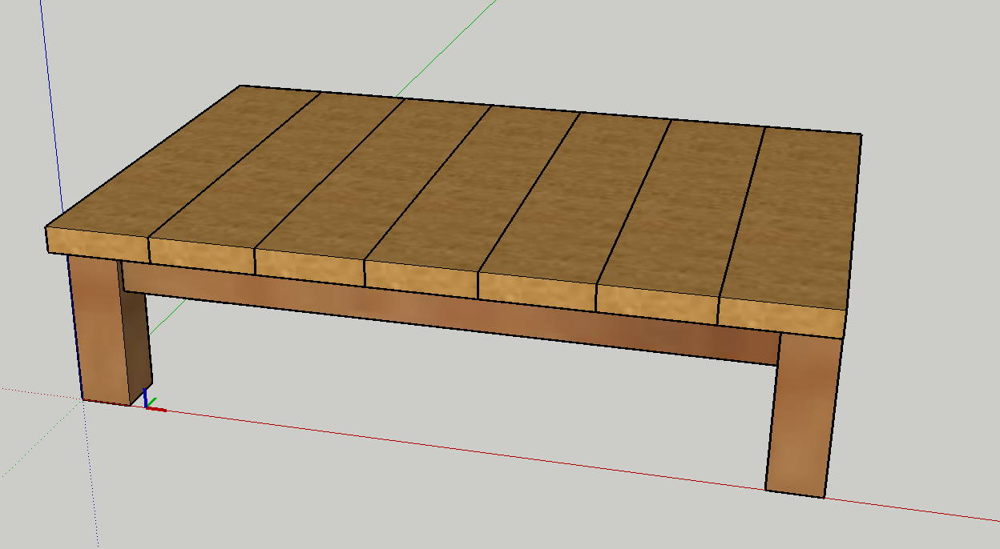
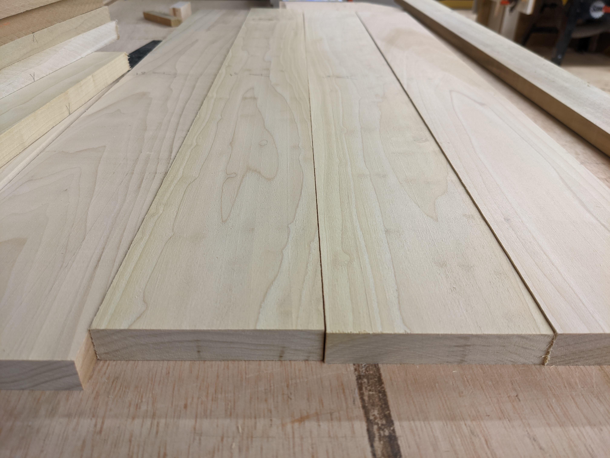
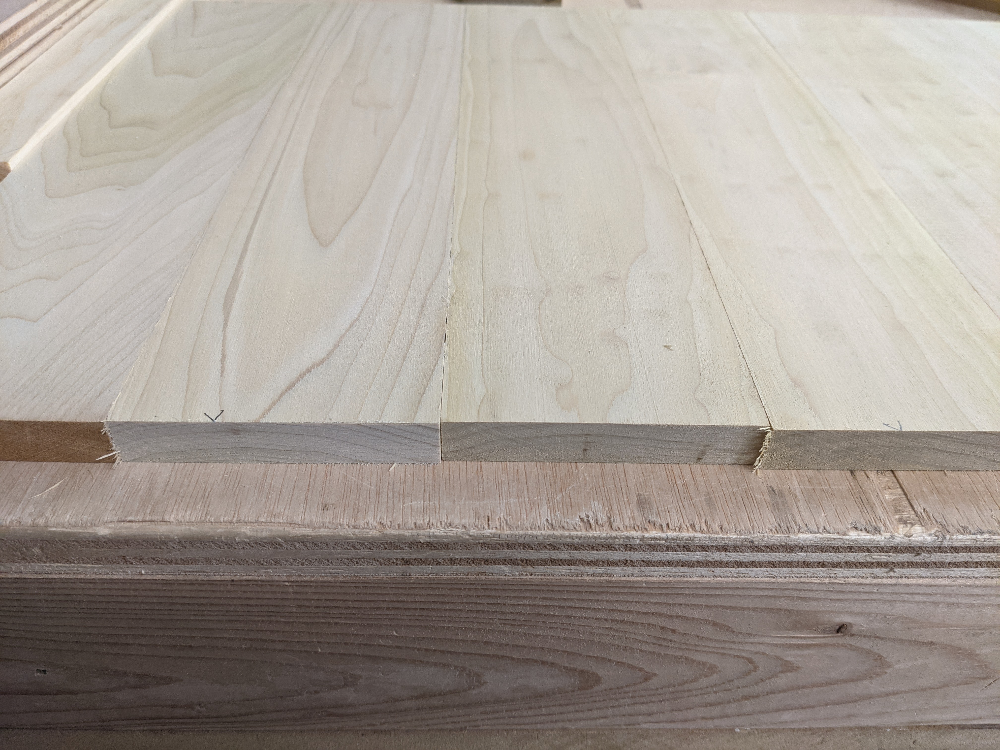
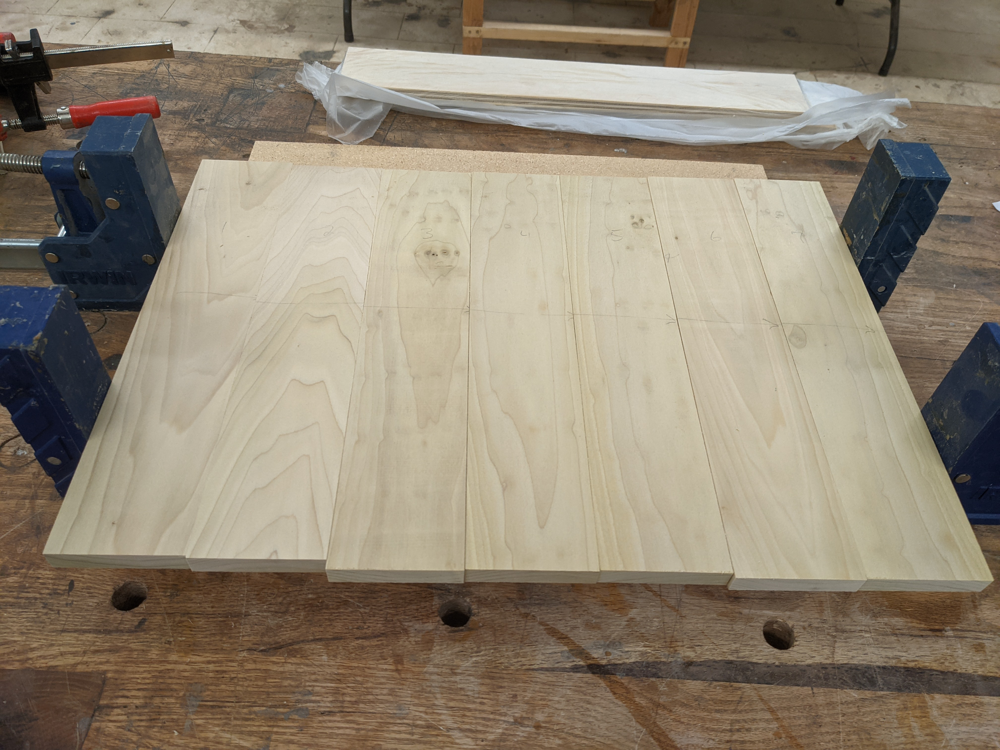
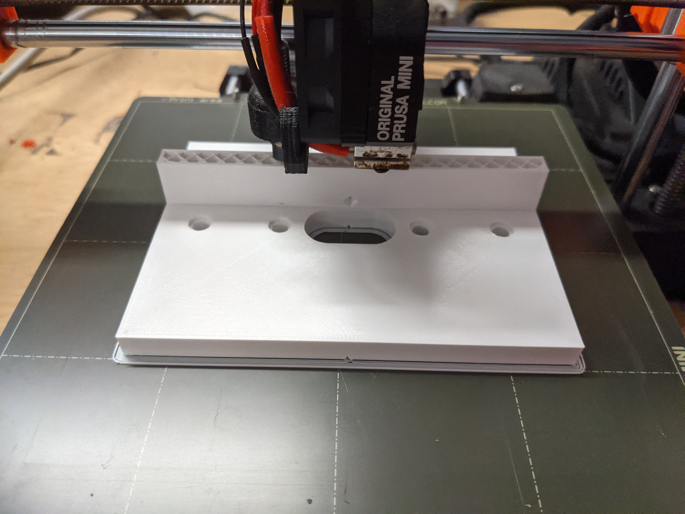
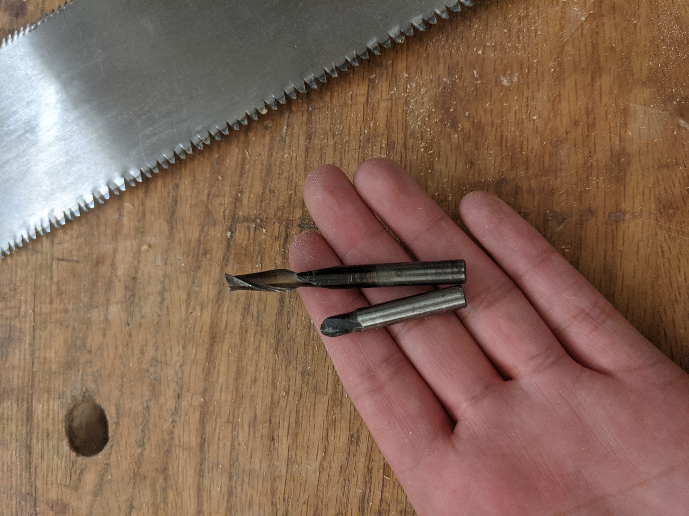
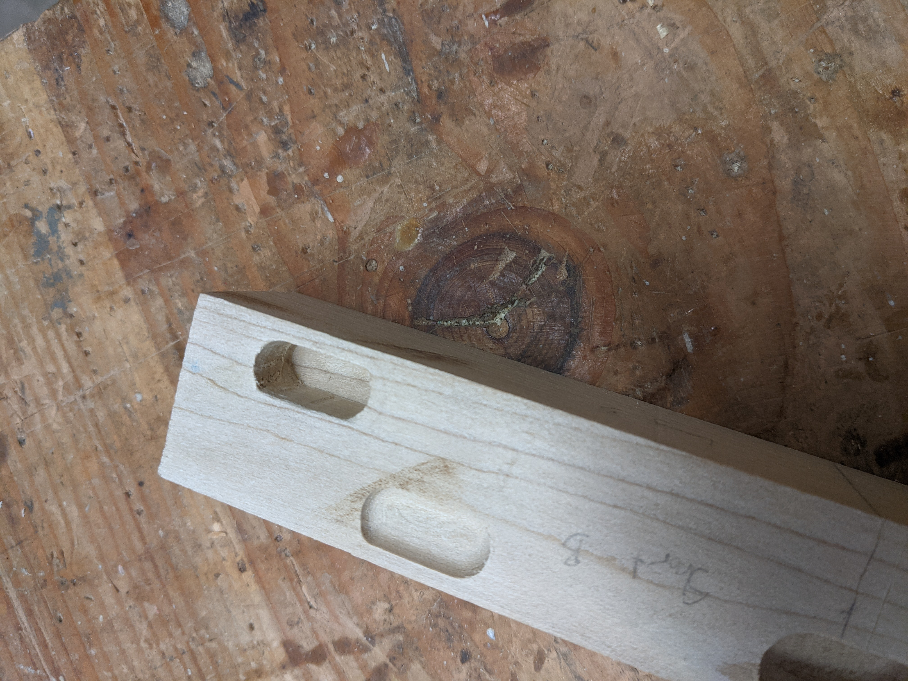
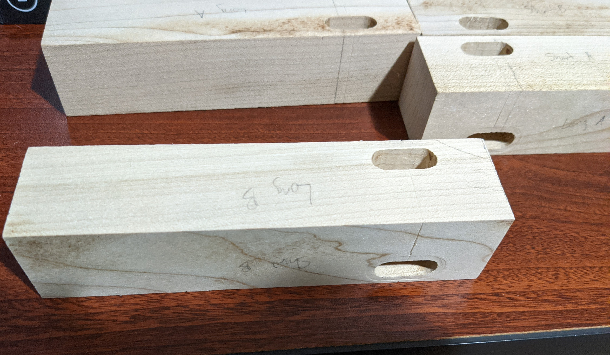
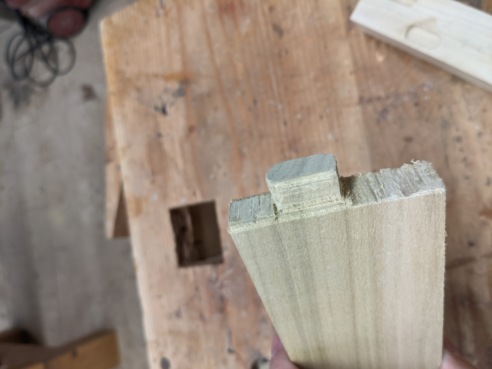
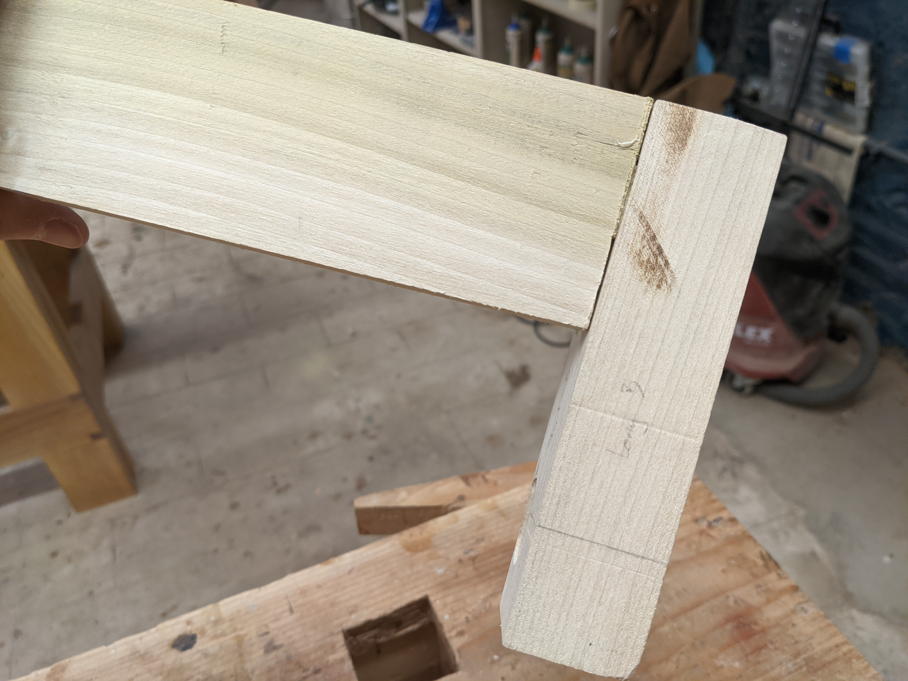

# Unit 2.2: Woodworking Project
This week (2021-10-04) we started the second half of Unit 2, Woodworking, where we decided on projects and worked on them. 

## What did I try to make?
I tried to make a small table/step stool that would make it easier for Hoppy to get in and out of the litter box. The original design was going to add a ramp to it but I decided to leave that for a future enhancement.  Rabbits shouldn't be in cages since they are uncomfortable, but that's what I currently have to use as a litter box.  My thinking was that he would use the ramp first and then be able to just walk into the cage, rather than having to jump directly in and out of the cage.

<figure>
  </img>

  <figcaption>
Updated design, without the ramp
</figcaption>
</figure>

## The Panel
Making the panel/top out of 1"x4" poplar went pretty well. I initially had issues with tearout on the jointer and planer, so I held off on the glue-up so I could get advice on why the boards looked worse after jointing/planing.
<figure>
  </img>

  <figcaption>
My first attempt: I felt like it was almost there, and wanted to get advice on it before doing anything else with it
</figcaption>
</figure>

<figure>
  </img>

  <figcaption>
The panel turned out much flatter and the edges of each board fit much better
</figcaption>
</figure>

<figure>
  </img>

  <figcaption>
Right before gluing up the panel
</figcaption>
</figure>

## The Legs
Making the legs and cutting out the mortises that parts of the apron would fit into went well, even though I had to deviate from the design due to the mortise router template I used.

<figure>
  </img>

  <figcaption>
The 3D printed router template I used
</figcaption>
</figure>

<figure>
  </img>

  <figcaption>
Router bits I tried for cutting the mortises
</figcaption>
</figure>

<figure>
  </img>

  <figcaption>
Trying out different mortise sizes
</figcaption>
</figure>

<figure>
  </img>

  <figcaption>
The legs with the mortises (before removing all the writing and marks
</figcaption>
</figure>

## The Apron
I wasn't sure yet how I was going to make the tenons attached to the apron since the template I used had the mortises laid out differently than I expected.  Because I was recommended to hand-cut the tenons, I went with that.

I accidentally ripped the apron's boards too thin, so I couldn't work on the tenons in time.

On the bright side, my first attempt at cutting the tenon worked out!

<figure>
  </img>

  <figcaption>
I cut this tenon using a Japanese-style pull saw after using a circle marking gauge to draw out some lines
</figcaption>
</figure>

<figure>
  </img>

  <figcaption>
Look ma, no glue!
</figcaption>
</figure>

## Conclusion
All in all, I'm pretty happy with how the panel and the legs worked out.  I definitely would want to continue this project and see what I can do about the tenons.
