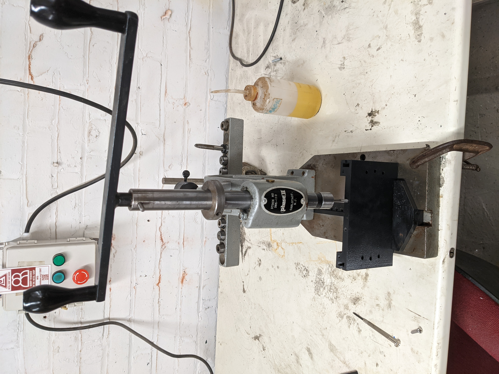

# Unit 3.1: Intro to Metalworking
This week (2021-10-11) we started the first half of Unit 3, Metalworking.

## What might I want to make?
I'm going to be pretty busy at work this week, and given the difficulty of the last project, I'm thinking I'd work on the hand plane mentioned before, and/or welding what could be the legs for the previous stool.

## What did I try to get badged on?
I got badged on: 
* the hand tapper so I could tap threads into plastic, which I could later use on metal.

<figure>
  </img>

  <figcaption>
Hand Tapper
</figcaption>
</figure>

* bench grinder
* wire wheel, good for cleaning up parts
* horizontal bandsaw
* MIG welder

I was most worried about welding due to all the things could go wrong, like getting electrocuted or getting molten metal on one's skin.  You know, the usual stuff. Turned out way better than I thought though.

<figure>
  </img>

  <figcaption>
My first weld
</figcaption>
</figure>