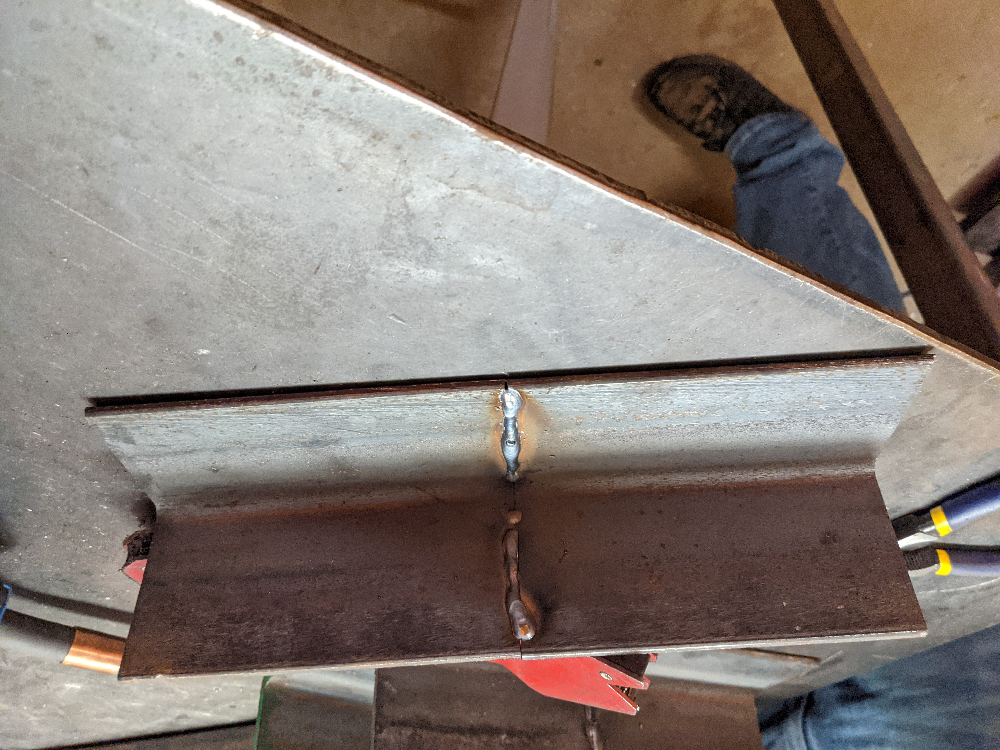

# Unit 3.2: Metalworking, or Welcome to the Machine (Shop)
On 2021-10-18, we did the second half of Unit 3, Metalworking. I decided to work on the frame for the stool since this was going to be a busy week. I'd have to cut corners and call it finished, no matter how janky the final product came out.

<figure>
  </img>

  <figcaption>
My first weld
</figcaption>
</figure>

# [🎵 The Less I Know, The Better 🎵](https://music.youtube.com/watch?v=PvM79DJ2PmM)
I wasn't able to attach the legs to the frame of the table, since I wanted to learn the basics of the waterjet to close the ends of the legs and tap them so the legs could be removable. I want to make the legs removable so the parts could be re-used when I design a better project. I decided to accept that I didn't know enough about the different tools to make that happen, so I didn't tack weld the legs on.

<figure>
  </img>

  <figcaption>
🎵 Working 9 to 5, what a way to weld a frame 🎵
</figcaption>
</figure>

<figure>
  </img>

  <figcaption>
My welded frame, but with a twist!
</figcaption>
</figure>

<figure>
  </img>

  <figcaption>
I had to give myself a manicure before taking this photo
</figcaption>
</figure>