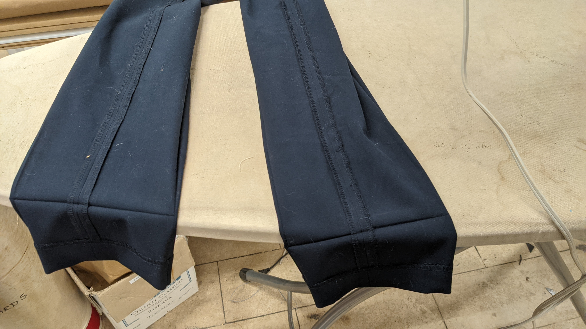

# Unit 4: Textiles
On 2021-10-25, we started the Textiles unit. I wanted to hem a pair of dress pants that I picked up a while ago.  I bought the pants thinking that I loved how they looked, but that they needed to be shorter.

<figure>
  </img>

  <figcaption>
The Sewing Machine I practiced with
</figcaption>
</figure>

<figure>
  </img>

  <figcaption>
Where I ironed the cut line
</figcaption>
</figure>

<figure>
  </img>

  <figcaption>
Most of the challenge was getting the pants to stay on the machine
</figcaption>
</figure>

<figure>
  </img>

  <figcaption>
The final product
</figcaption>
</figure>