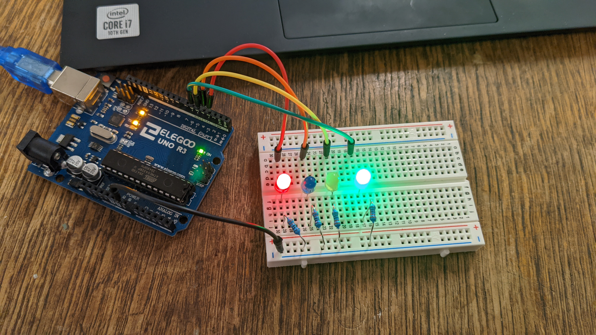
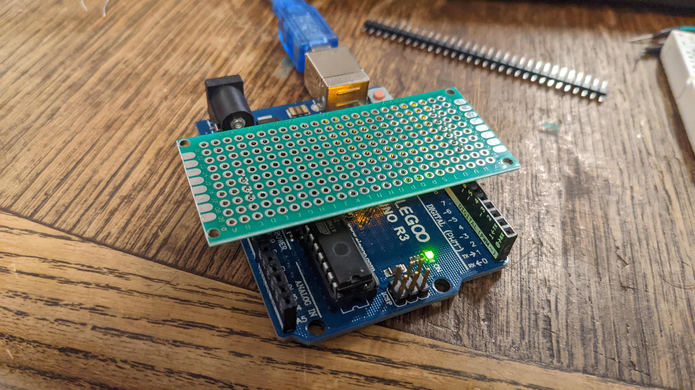

# Unit 5: Electronics
For the weeks of 2021-11-01 and 2021-11-08, we did Electronics week, where we covered the basics of soldering, using breadboards, and Arduino.

I am juggling multiple side projects and decided to keep it simple. I'd practice setting up Arduinos and more importantly, practicing my soldering skills.

<figure>
  </img>

  <figcaption>
Practicing on a breadboard first so I can practice the Arduino setup
</figcaption>
</figure>

<figure>
  </img>

  <figcaption>
This is an area I haven't practiced at all before.
</figcaption>
</figure>
