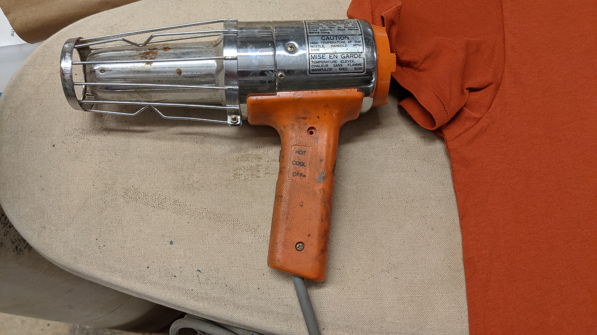
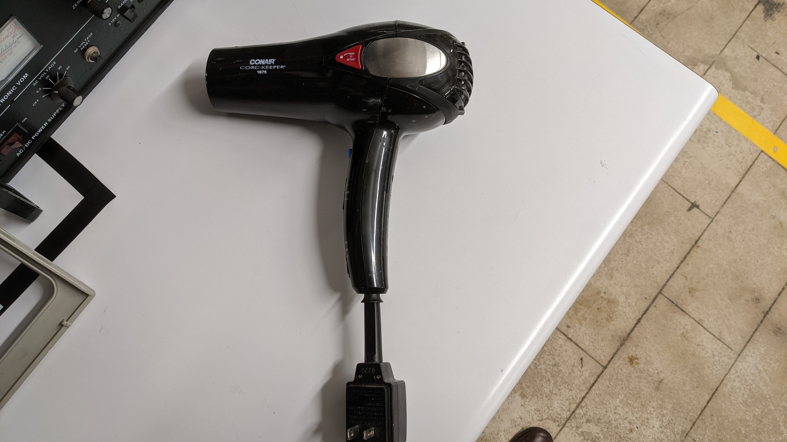
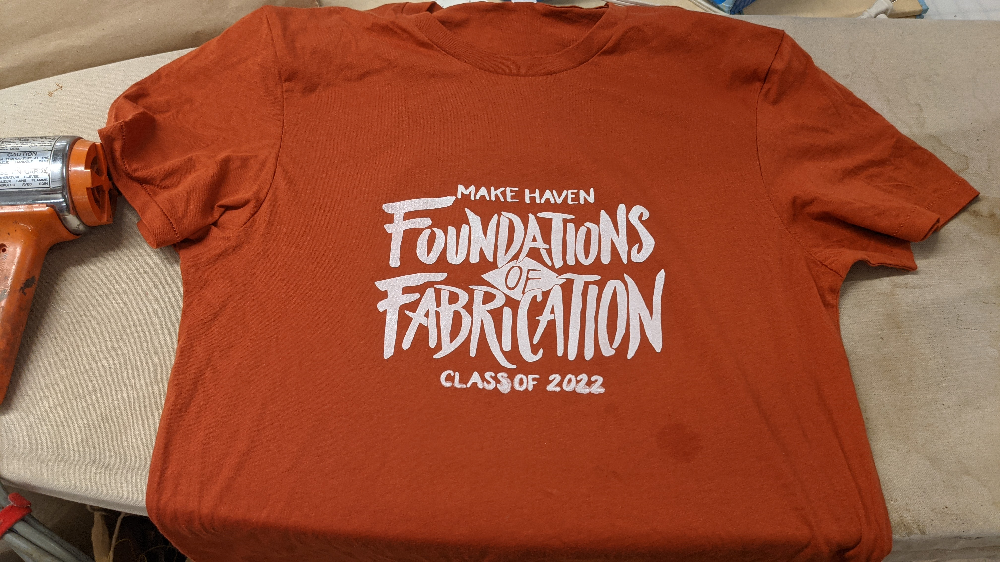

# Unit 6: Printmaking
2021-11-15: We got to make "Finished Intro" shirts! I forgot to bring a shirt, but thankfully there was a nice stretchy shirt in the MakeHaven store for me to use.

<figure>
  </img>

  <figcaption>
After doing a pull, use this...
</figcaption>
</figure>

<figure>
  </img>

  <figcaption>
...not this, which I found first when looking for the heat gun.
</figcaption>
</figure>

<figure>
  </img>

  <figcaption>
The final product
</figcaption>
</figure>
