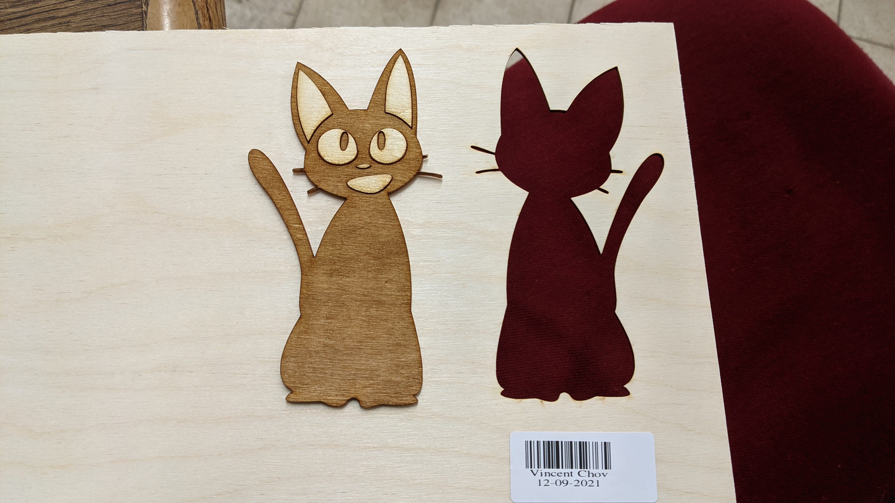
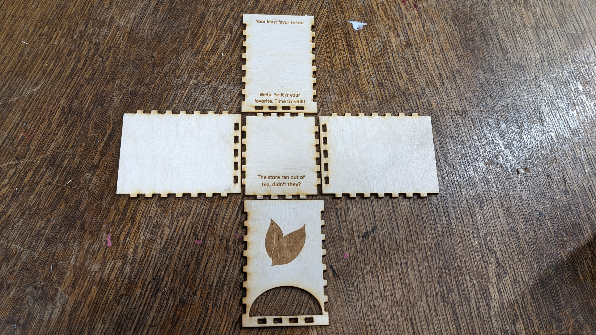
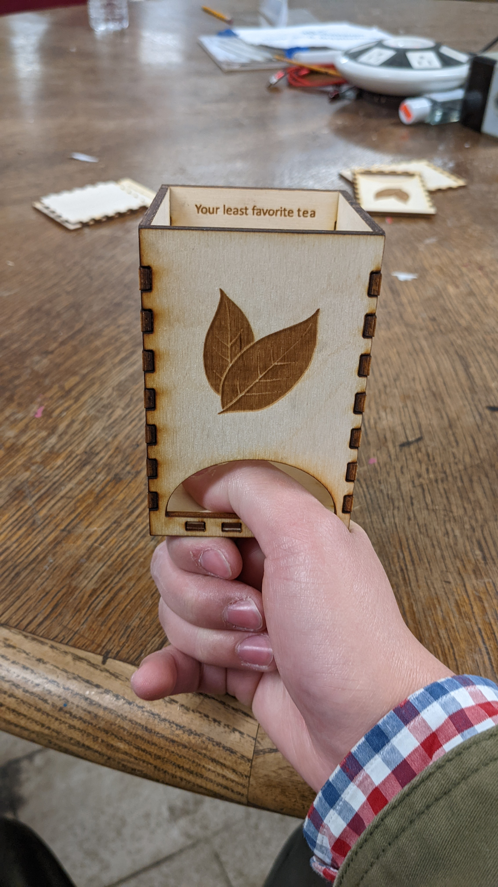
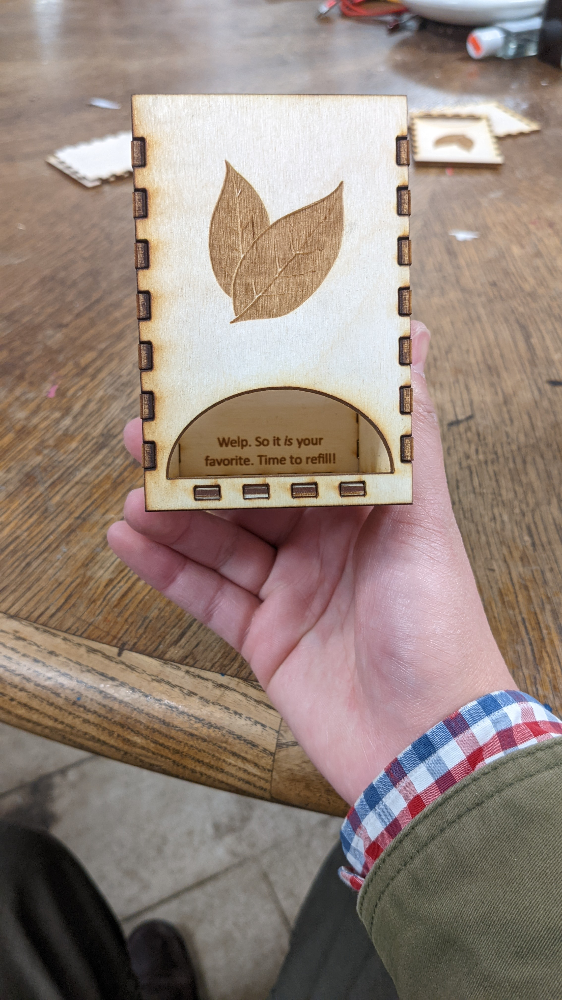
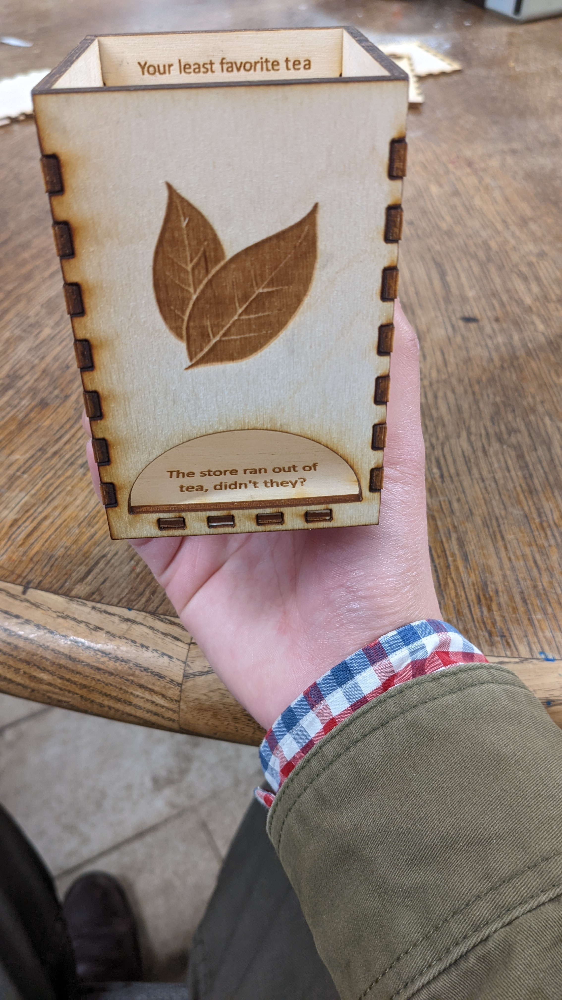

# Unit 7: 2D Design and Making
2021-11-29 and 2021-12-06: We returned to learning about 2D design in Inkscape and applied them to the Vinyl Cutter and to the Laser Cutter.

<figure>
  </img>

  <figcaption>

</figcaption>
</figure>

<figure>
  </img>

  <figcaption>

</figcaption>
</figure>

<figure>
  </img>

  <figcaption>

</figcaption>
</figure>

<figure>
  </img>

  <figcaption>

</figcaption>
</figure>

<figure>
  </img>

  <figcaption>

</figcaption>
</figure>

<figure>
  </img>

  <figcaption>

</figcaption>
</figure>