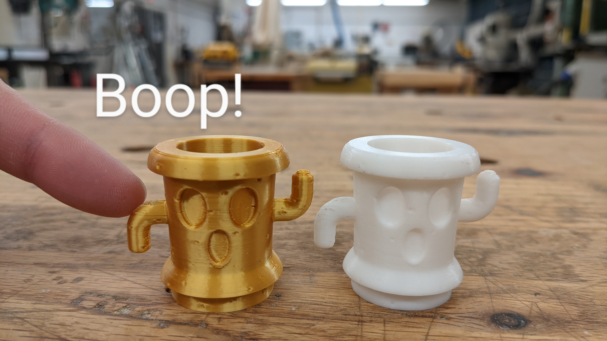
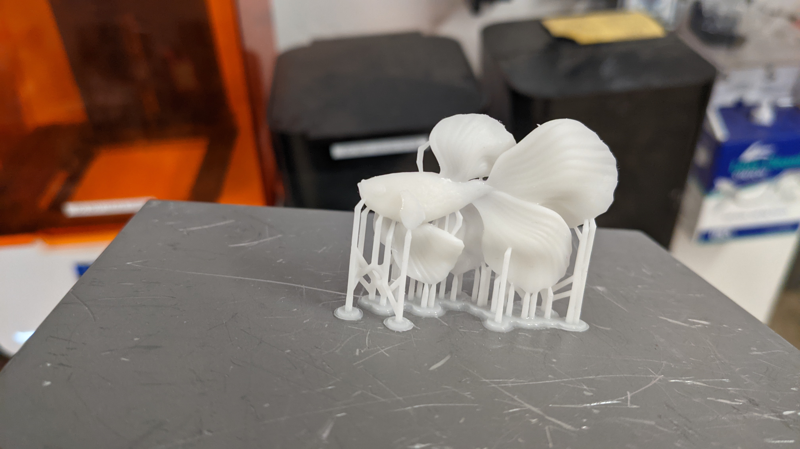
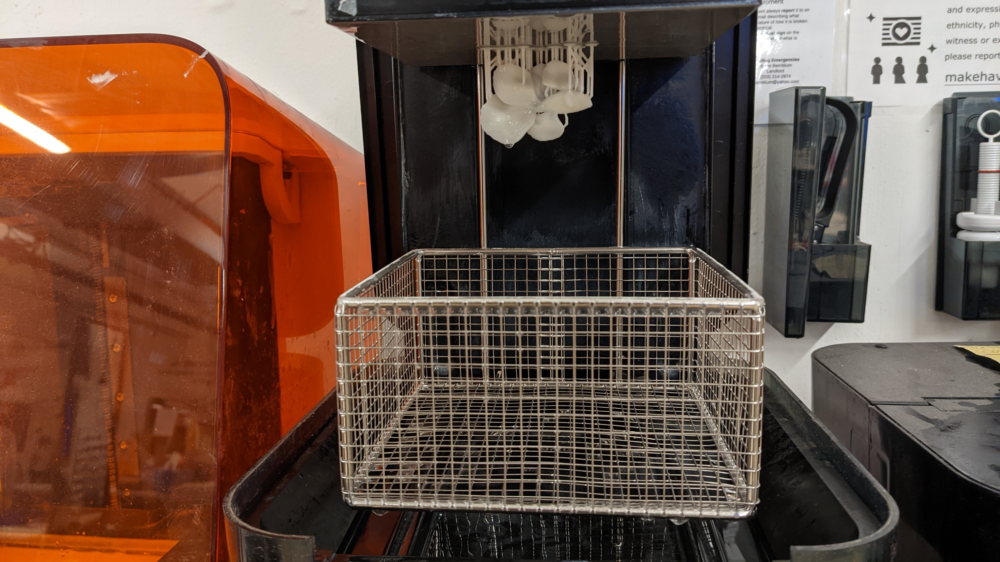
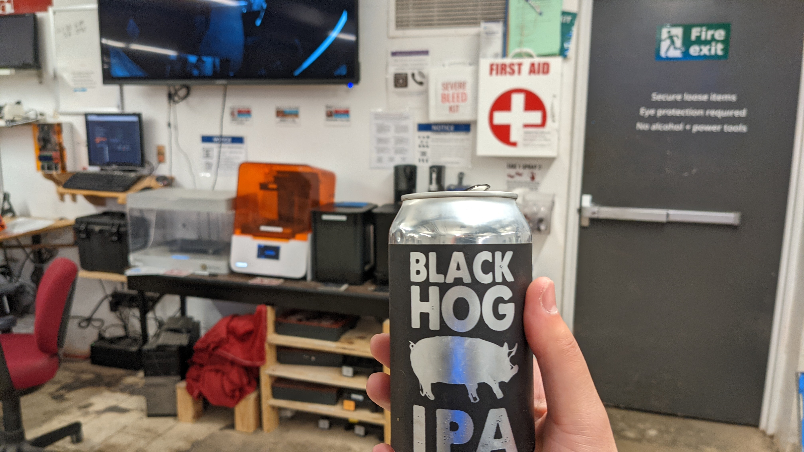
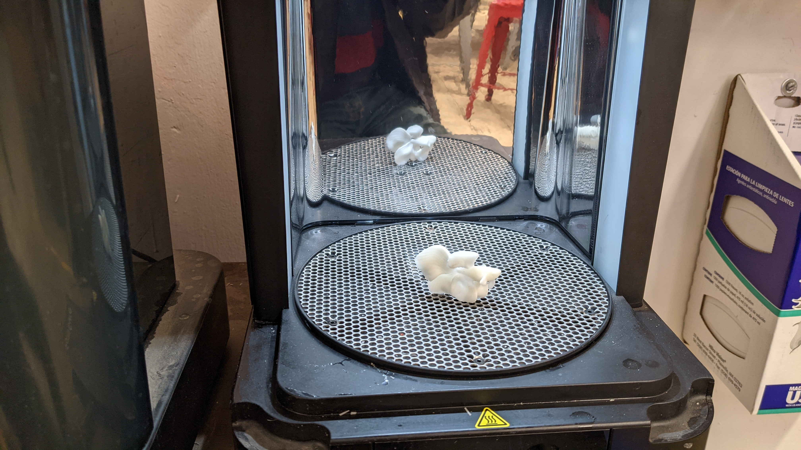
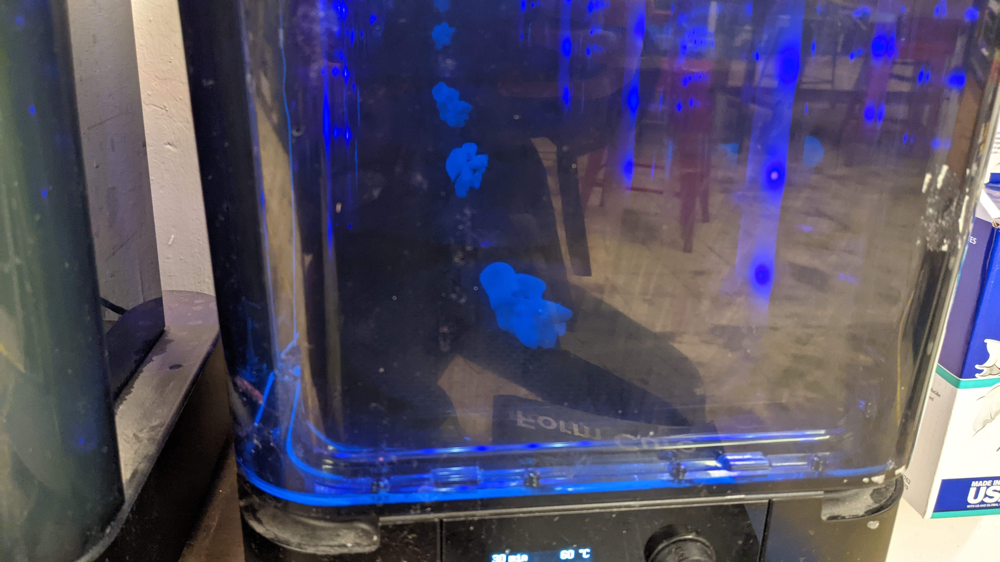

# Unit 8: 3D Design and Making
2021-12-13 and 2021-12-20: We moved from practicing 2D design to 3D design.  I had started some projects early that kept me busy during previous weeks, and most of them were related to 3D printing.

<figure>
  </img>

  <figcaption>

</figcaption>
</figure>

<figure>
  </img>

  <figcaption>

</figcaption>
</figure>

<figure>
  </img>

  <figcaption>

</figcaption>
</figure>

<figure>
  </img>

  <figcaption>

</figcaption>
</figure>

<figure>
  </img>

  <figcaption>

</figcaption>
</figure>

<figure>
  </img>

  <figcaption>

</figcaption>
</figure>

<figure>
  </img>

  <figcaption>

</figcaption>
</figure>

<figure>
  </img>

  <figcaption>

</figcaption>
</figure>